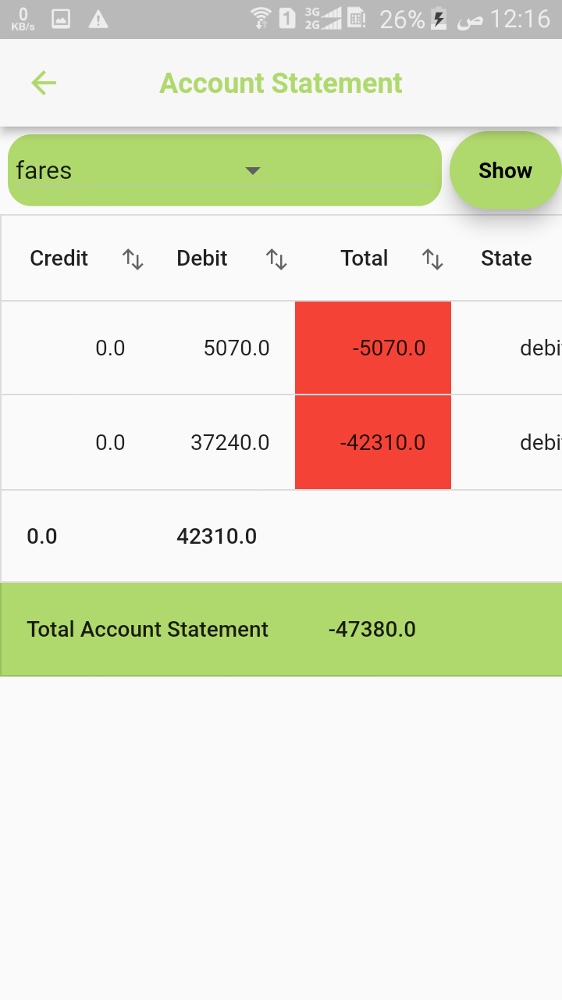
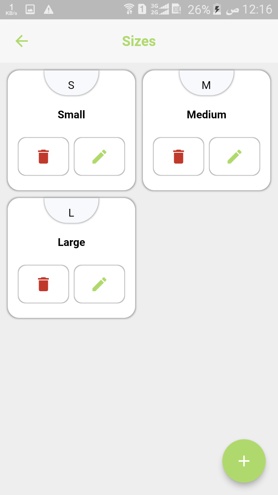
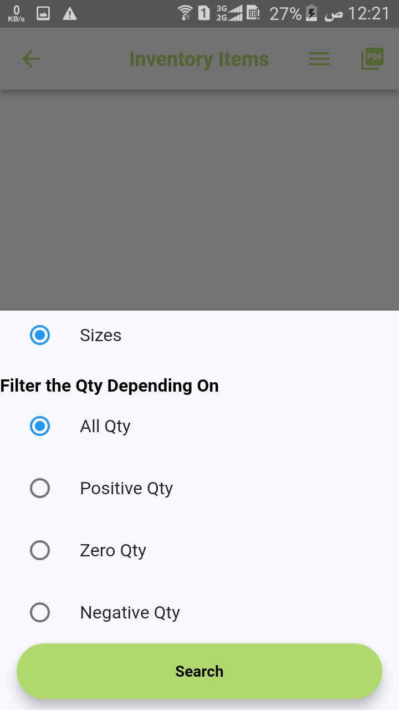
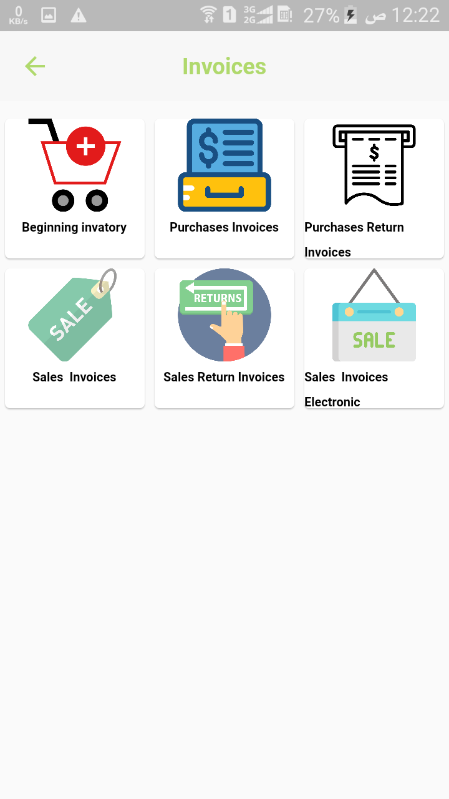

# kingfashion
has 3 folder kingadmin ,king customer and king api
# Tow Apps E-commerce  For Customer And Admin
###  Customer App

<!--    -->
  
  
  
 

    
  
  

  

    
   
  
 
   

   
  
  
 

   
  
  
   

  
  
  
   

   
<!--     -->
   

###  Admin App

  
  
  
 

    
  
  

  

    
   
  
 
   

   
  
  
 

   
  
  

  
  
     

   
      
   

  
  
  
 

   
  
  
   

 
  
   
   

  
     
    

 
